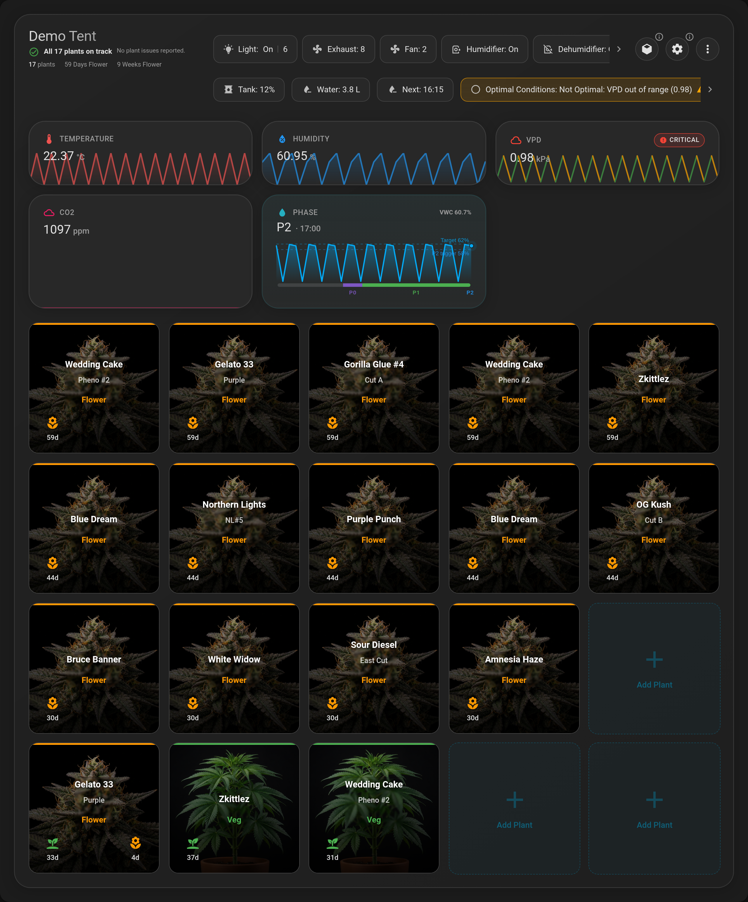
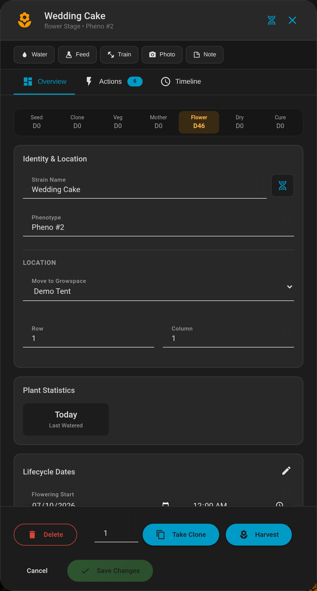
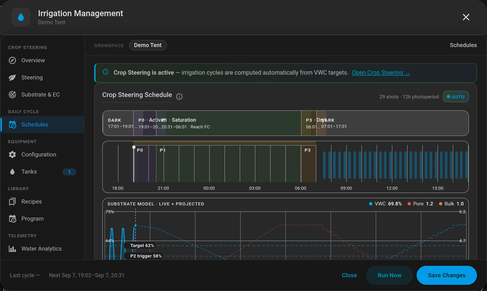
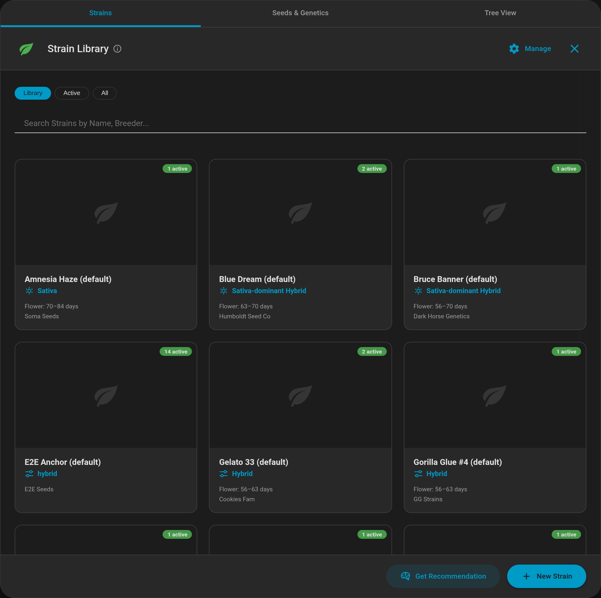
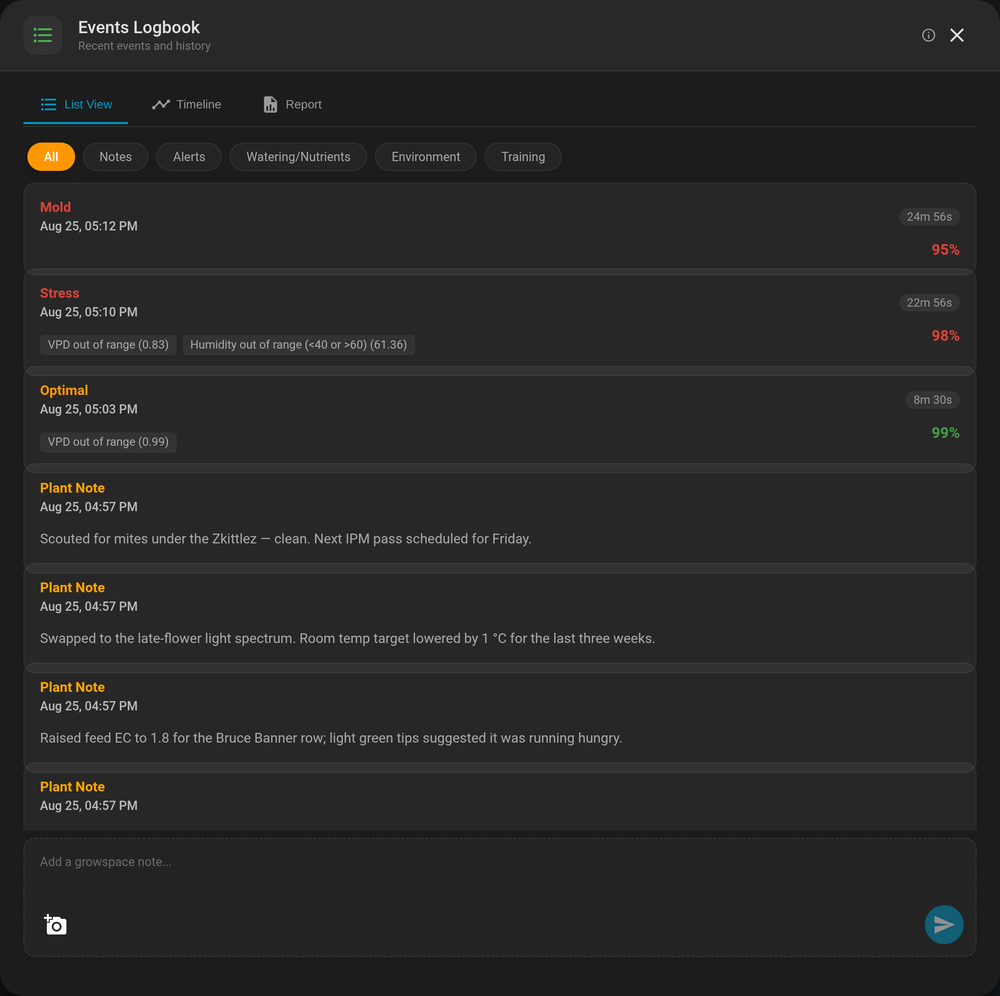
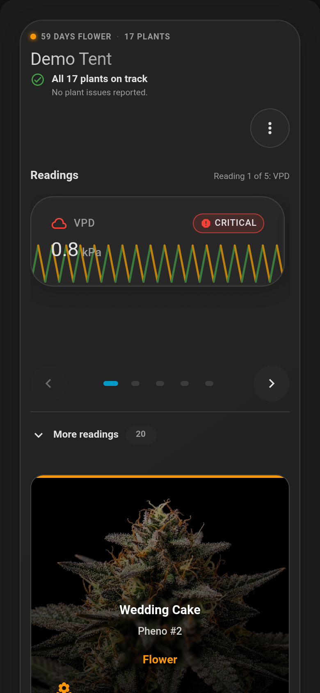

# Lovelace Growspace Manager Card

A premium, feature-rich **Home Assistant Lovelace custom card** designed for the modern grower. Manage multiple growspaces, track complex plant lifecycles, and leverage AI to optimize your environment—all from a sleek, glassmorphism-inspired interface.


_Unified view: plant grid with per-stage imagery and day counters, environmental
sparklines, and the live crop-steering phase._

[**Try the live demo →**](https://Venosta-web.github.io/lovelace-growspace-manager-card/demo/)

The demo is the real card running against a recorded snapshot of a Home Assistant
growspace — open a plant, browse the strain library, page through the irrigation
dialogs. Nothing is persisted; reload to reset.

---

## Requirements

This card is the frontend companion to the **Growspace Manager Backend** integration. It relies on the backend for data persistence, strain library management, and advanced sensor logic.

- **Backend Repository:** [Growspace Manager Integration](https://github.com/Venosta-web/growspace_manager)

---

## Features

### 🌱 Plant Management

- **Visual Grid System**: Drag-and-drop plants to rearrange your tent.
- **Lifecycle Tracking**: Automate tracking for `seedling`, `veg`, `flower`, `dry`, and `cure` stages.
- **Batch Actions**: Select multiple plants to water, move, or delete in bulk.
- **Undo/Redo System**: Made a mistake? Seamlessly undo moves, deletions, and heavy modifications with a robust history stack.

### 🧠 Intelligence & Automation

- **Grow Master AI**: Integrated AI assistant that analyzes your sensor data to provide context-aware gardening advice and stress diagnosis.
- **Smart Irrigation**: Manage complex irrigation schedules and strategies (e.g., "Crop Steering") directly from the UI.
- **Strain Recommendations**: Get data-driven strain suggestions based on your specific environmental conditions.
- **Integrated Pest Management (IPM)**: Track and manage pest treatments with customizable presets for foliar sprays, root drenches, and beneficial insects.

### 🌧️ Environment Control

- **Dehumidifier Integration**: Automate humidity management. Set target VPD or humidity setpoints for different stages (day/night).
- **Smart Thresholds**: Configure specific triggers (On/Off) for your dehumidifier based on plant stage.
- **Device Tracking**: Monitor connection status and historical performance of your environmental sensors ensuring your equipment is always online.

### 📊 Environmental Monitoring

- **Real-time Analytics**: Toggleable chips for Temperature, Humidity, VPD, and CO2 with historical sparklines.
- **Light Cycle History**: Visual timeline of light ON/OFF states over the last 24 hours.
- **Calculated Metrics**: Automatic VPD calculation and "Lung Room" monitoring.

### 🎨 Modern UX

- **Glassmorphism Design**: A transparent, premium aesthetic that blends with any dashboard background.
- **Interactive Toasts**: Actionable notifications (e.g., "Undo" directly from a success message).
- **Keyboard Shortcuts**: Power user controls for rapid management.
  - `Arrow Keys`: Navigate the grid.
  - `Enter / Space`: Select or interact with a plant.
  - `Delete / Backspace`: Delete selected plant(s).
- **Mobile Responsiveness**: Adaptive layout that switches to a list view on mobile for better usability.

### 🖱️ Interaction Guide

- **Add Plant**: Click any empty grid slot.
- **Edit/Manage**: Click an existing plant to open the management dialog.
- **Move**: Drag and drop to rearrange (Desktop) or use the "Move" action (Mobile).
- **Multi-Select**: Hold `Shift` + Click to select multiple plants for batch actions.

---

## Screenshots

### Plant management

Click any plant for its full lifecycle: stage timeline with day counts, identity
and grid position, watering history, and one-tap actions for cloning and harvest.



### Crop steering

Phase-driven irrigation (P0–P3) computed from VWC targets, with the live
substrate model projected forward against the day's photoperiod.



### Strain library

Manage your genetics with a searchable visual library — breeder, type, flowering
window, and how many plants of each strain are currently running.



### Logbook

Environmental alerts and your own notes on one timeline, filterable by category.



### Mobile

On narrow screens the environment readings become a swipeable carousel and the
plant grid stacks into a single column.



---

## Installation

### Using HACS (Recommended)

1. Add this repository to HACS under **Custom Repositories** with category `Frontend`.
2. Install `lovelace-growspace-manager-card`.
3. Add to your Lovelace dashboard:
   ```yaml
   type: 'custom:growspace-manager-card'
   default_growspace: your_growspace_id_or_name
   ```

### Manual Installation

1. Download `growspace-manager-card.js` from the [latest release](https://github.com/Venosta-web/lovelace-growspace-manager-card/releases/latest) (or build it yourself with `npm run build`, which outputs `dist/growspace-manager-card.js`) and copy it to your Home Assistant `www` folder.
2. Add the resource in your Dashboard configuration:
   ```yaml
   resources:
     - url: /local/growspace-manager-card.js
       type: module
   ```
3. Add the card to your view.

---

## Configuration

### YAML Configuration Links

Standard Lovelace configuration options:

| Name              | Type   | Key                 | Description                                     |
| ----------------- | ------ | ------------------- | ----------------------------------------------- |
| Type              | string | `type`              | Must be `custom:growspace-manager-card`         |
| Default Growspace | string | `default_growspace` | The ID of the growspace to show by default.     |
| View Mode         | string | `initial_view_mode` | Initial view: `standard`, `compact` or `header` |
| Theme             | string | `theme`             | Override theme: `default`, `dark`, `green`      |

The standalone analytics card can be declared as a dedicated Graph Wall:

```yaml
type: custom:growspace-analytics-card
default_growspace: your_growspace_id_or_name
start_in_graph_wall: true
hidden_graphs:
  - humidity
  - co2
```

`start_in_graph_wall` defaults to `false`. When enabled, the card opens its desktop Graph Wall
after each dashboard reload; exiting the Wall affects only the current page load. Use
`hidden_graphs` (or the **Hidden Graphs** selector in the visual editor) to omit selected metrics
from both the inline analytics card and its Graph Wall. This is card-local and does not close the
same graphs in other Growspace Manager cards.

### UI Configuration

Most advanced configuration is handled via the **UI Configuration Dialog** (Cog icon) inside the card itself:

1. **Growspace & Devices**: Create logical "Growspaces" (tents/rooms) and map them to physical devices or sensors.
2. **Environment Setup**: Map your critical sensors for automation:
   - **Climate**: Temperature & Humidity sensors.
   - **Lighting**: Light status binary sensors/power monitors.
   - **CO2**: ppm sensors.
   - **Dehumidifier**: Entity and threshold configuration.
3. **Global Settings**: Configure "Lung Room" sensors and weather providers for AI context.

---

## Architecture

Built with modern web standards and performance in mind:

- **Lit**: Lightweight web component library for fast rendering.
- **Nanostores**: Agnostic state management for reactive, predictable updates.
- **TypeScript**: Fully typed codebase for reliability and maintainability.
- **Rollup**: Efficient bundling for minimal footprint.

---

## Development

### Install Dependencies

```bash
npm install
```

### Build & Deploy

```bash
npm run build
```

This compiles the project and outputs `dist/growspace-manager-card.js` plus lazy-loaded
feature chunks. Manual installs must keep all emitted `dist/*.js` files together so relative
chunk imports resolve. HACS installs every JavaScript release asset automatically.

---

## Contributing

1. Fork the repository.
2. Create a feature branch (`git checkout -b feature/my-feature`).
3. Commit changes (`git commit -m 'Add new feature'`).
4. Push to the branch (`git push origin feature/my-feature`).
5. Open a pull request.

---

## License

MIT License – see [LICENSE](LICENSE) file.

---

## Credits

- Built with [Lit](https://lit.dev/) & [TypeScript](https://www.typescriptlang.org/)
- UI Components by [Material Web (M3)](https://github.com/material-components/material-web)
- Icons from [Material Design Icons](https://materialdesignicons.com/)
- Timezone handling with [Luxon](https://moment.github.io/luxon/)
