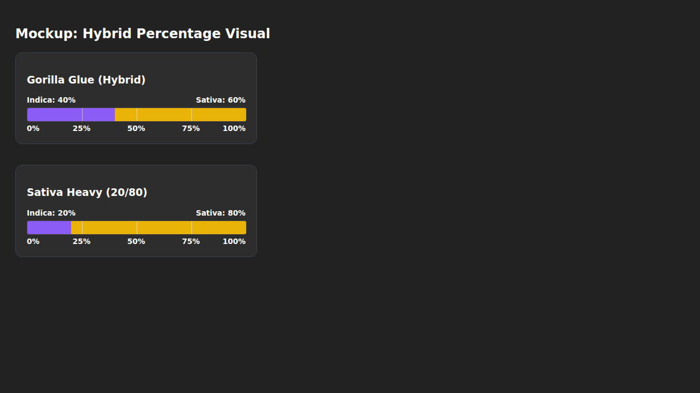
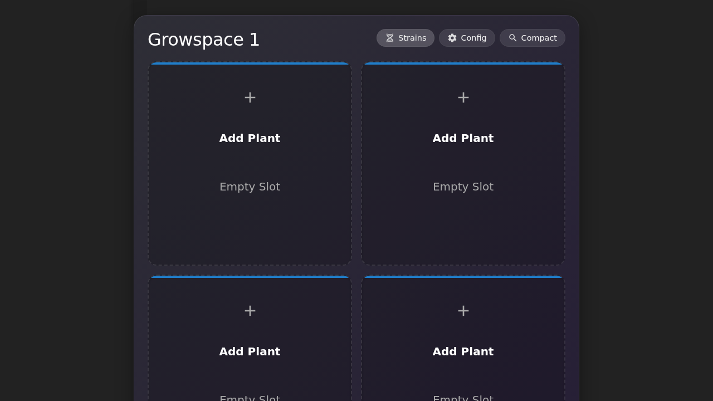
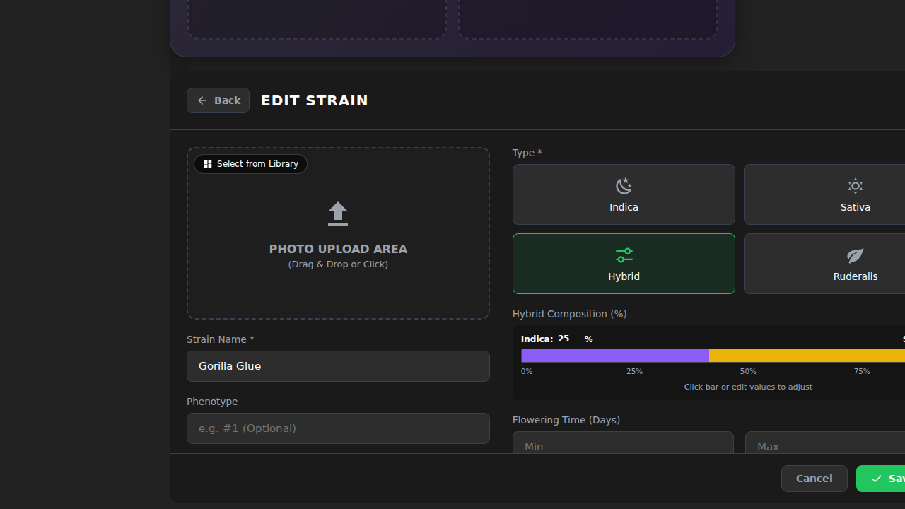
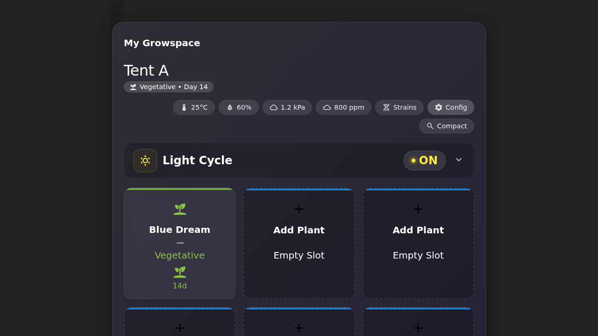
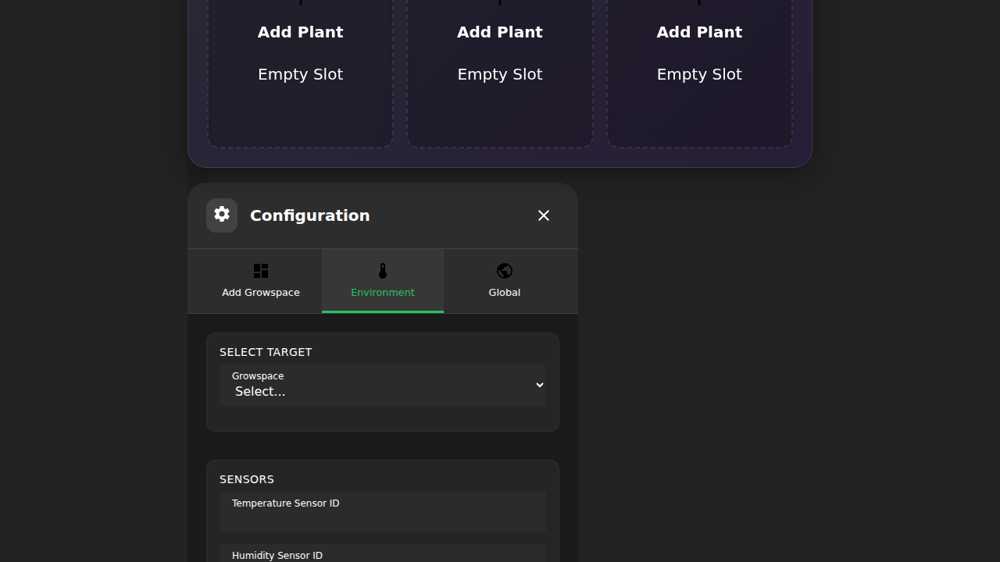
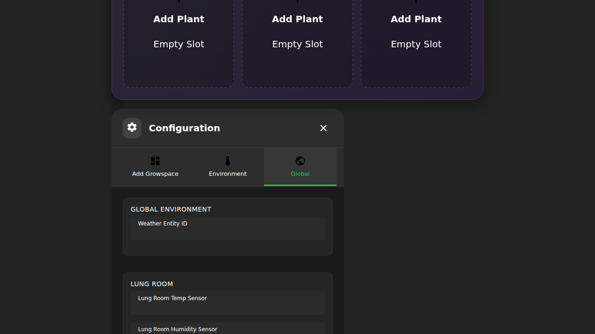

# Lovelace Growspace Manager Card

A modern, comprehensive **Home Assistant Lovelace custom card** designed to manage multiple growspaces, track plant lifecycles, and monitor environmental conditions. Built with **Lit**, **TypeScript**, and **Rollup**, featuring a sleek glassmorphism UI.


*Unified view showing plant grid, light cycle history, and environmental stats*

---

## Requirements

This card requires the **Growspace Manager Backend** component to be installed and configured in Home Assistant. It relies on the backend for data persistence, strain library management, and sensor integration.

- **Backend Repository:** [Growspace Manager Integration](https://github.com/Venosta-web/growspace_manager)

---

## Features

- **Unified Glassmorphism UI:** A modern, transparent design that blends seamlessly with your dashboard background.
- **Plant Management:**
  - **Drag-and-Drop:** Easily rearrange plants within the grid.
  - **Lifecycle Tracking:** Track days in `veg`, `flower`, `dry`, and `cure` stages.
  - **Harvest & Curing:** Dedicated workflows for harvesting plants and moving them to curing.
- **Advanced Strain Library:**
  - **Visual Browsing:** browse strains with images and stats.
  - **Editor:** Add and edit strains, including hybrid genetics (Sativa/Indica %), flowering days, and breeder info.
  - **Image Management:** Upload, crop, and assign images to specific phenotypes.
- **Environmental Monitoring:**
  - **Light Cycle History:** Visual timeline of light ON/OFF states with 24h history.
  - **Environmental Chips:** Toggleable stats for Temperature, Humidity, VPD, and CO2 with historical graphs.
- **Mobile Responsiveness:** Adaptive layout that switches to a list view on mobile devices for better usability.
- **Configuration UI:** robust built-in configuration for managing growspaces, sensors, and global settings.

---

## Screenshots

### Strain Library
Manage your genetics with a visual library.

| Browse View | Editor View |
|:---:|:---:|
|  |  |

---

## Installation

### Using HACS (Recommended)
1. Add this repository to HACS under **Custom Repositories** with category `Frontend`.
2. Install `lovelace-growspace-manager-card`.
3. Add to your Lovelace dashboard:
   ```yaml
   type: 'custom:growspace-manager-card'
   default_growspace: your_growspace_id_or_name
   ```

### Manual Installation
1. Copy `dist/growspace-manager-card.js` to your Home Assistant `www` folder.
2. Add the resource in your Dashboard configuration:
   ```yaml
   resources:
     - url: /local/growspace-manager-card.js
       type: module
   ```
3. Add the card to your view.

---

## Configuration

You can configure the basic card settings via YAML, but most deep configuration (mapping sensors, creating growspaces) is done via the **UI Configuration Dialog** (Cog icon on the card).

### YAML Options

| Option | Type | Description |
| :--- | :--- | :--- |
| `type` | `string` | **Required.** Must be `custom:growspace-manager-card`. |
| `title` | `string` | Optional title displayed at the top. |
| `default_growspace` | `string` | The ID or Name of the growspace to load by default. |
| `compact` | `boolean` | If `true`, hides the large header stats for a more compact view. |

### UI Configuration

Click the **Cog Icon** in the card header to access the configuration menu.

#### 1. Add Growspace
Create new growspaces to manage different tents or rooms.


#### 2. Environment
Map your Home Assistant sensors (Temperature, Humidity, CO2, Power) to your growspace.


#### 3. Global Settings
Configure global preferences like weather providers and "Lung Room" sensors.


---

## Usage

### Plant Interaction
- **Add Plant:** Click an empty grid slot to add a new plant. You can select from your Strain Library or add a new one on the fly.
- **Move Plant:** Drag and drop a plant to a new slot to move it.
- **Edit/Harvest:** Click on a plant card to open the details dialog where you can change its stage, harvest it, or update its notes.

### Strain Library
- Access via the **Book Icon** in the header.
- Use the **Browse** tab to see all your strains.
- Use the **Editor** to fine-tune genetic details, upload images, and set breeder information.

### Monitoring
- **Light Cycle:** The graph in the header shows the last 24 hours of light history.
- **Environmental Chips:** Click on "Temp", "Humidity", etc., in the header to reveal detailed history graphs for those metrics.

---

## Development

### Install Dependencies
```bash
npm install
```

### Build & Deploy
```bash
npm run build
```
This compiles the project and outputs the bundle to `dist/growspace-manager-card.js`.

---

## Contributing

1. Fork the repository.
2. Create a feature branch (`git checkout -b feature/my-feature`).
3. Commit changes (`git commit -m 'Add new feature'`).
4. Push to the branch (`git push origin feature/my-feature`).
5. Open a pull request.

---

## License

MIT License – see [LICENSE](LICENSE) file.

---

## Credits

- Built with [Lit](https://lit.dev/) & [TypeScript](https://www.typescriptlang.org/)
- UI Components by [Material Web (M3)](https://github.com/material-components/material-web)
- Icons from [Material Design Icons](https://materialdesignicons.com/)
- Timezone handling with [Luxon](https://moment.github.io/luxon/)
